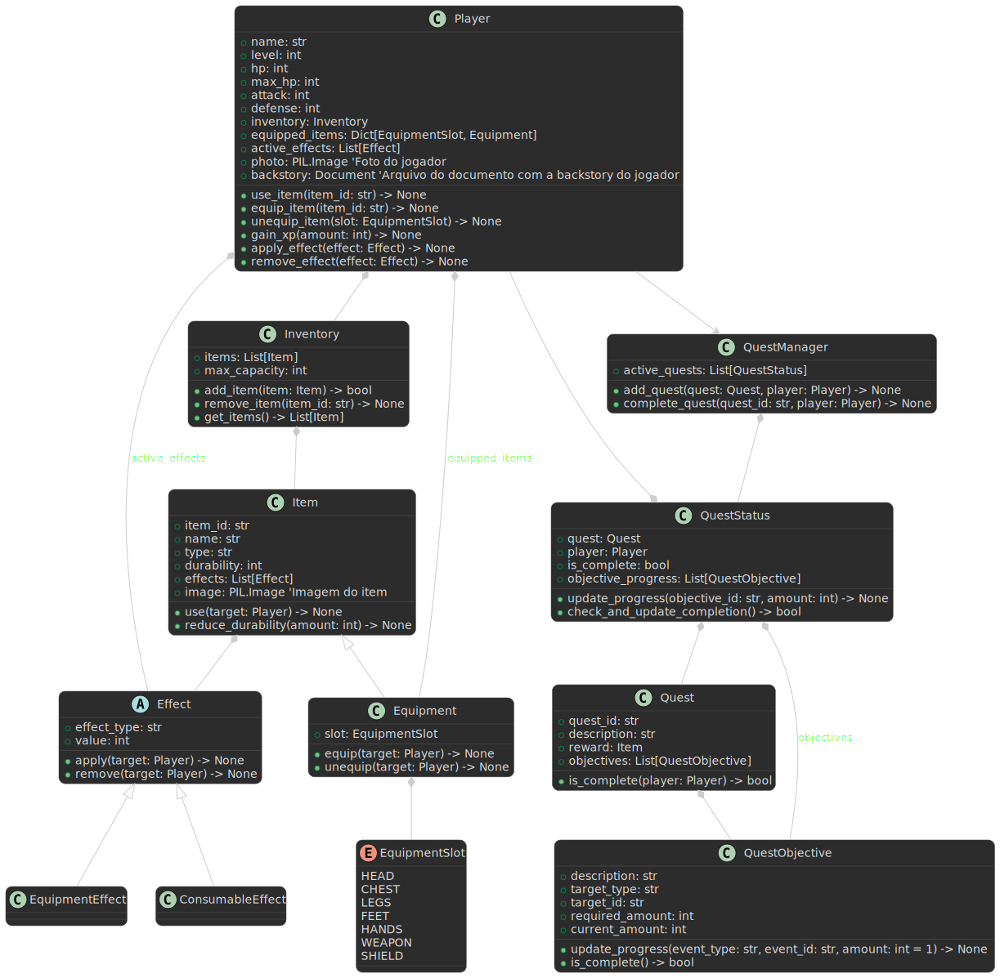

# 🎮 QuestVault

Projeto acadêmico desenvolvido para a disciplina de **Sistemas Distribuídos e Mobile** – Avaliação A3 – Etapa 01.

---

## 📑 Avaliação A3 – Etapa 01

- 👤 **Aluno:** Miguel Marques Duarte (8)  
- 📌 **Tema:** Aplicativo de Gamificação e Inventário de Itens (24)  
- 📚 **Disciplina:** Sistemas Distribuídos e Mobile

---

## 🧾 Descrição do Projeto

**QuestVault** é uma API REST desenvolvida em **Python** com **Django** e **Django REST Framework**, focada na gamificação e gerenciamento de inventário de itens. A proposta é permitir o cadastro, consulta e organização de jogadores, itens, efeitos e missões — proporcionando uma experiência interativa aplicável a contextos acadêmicos ou corporativos.

---

## 🎯 Requisitos e Objetivos

- Desenvolver uma API REST orientada a objetos e distribuída
- Utilizar versionamento com Git e branches específicas para cada componente
- Utilizar Python, Django e Django REST Framework
- Implementar **8+ classes**, com **4+ atributos** cada
- Criar 4 branches por classe: `model-`, `view-`, `url-`, `serializer-`
- Fazer no mínimo 2 commits por branch
- Persistir dados em **Oracle Database**, refletindo o modelo via API

---

## 🧰 Tecnologias Utilizadas

| Ferramenta           | Versão   | Descrição                                 |
|----------------------|----------|-------------------------------------------|
| 🐍 Python            | 3.13.2   | Linguagem principal (via Conda)           |
| 🌐 Django            | 5.2      | Framework web                             |
| 🔌 Django REST       | 3.16.0   | Framework para APIs RESTful               |
| 🔎 django-filter     | 25.1     | Filtros dinâmicos para DRF                |
| 🧪 python-decouple   | 3.8      | Gerenciamento de variáveis de ambiente    |
| 🗃️ oracledb          | 2.5.1    | Driver Oracle                             |
| 🖼️ Pillow            | 11.1.0   | Manipulação de imagens                    |
| 📝 Markdown          | 3.8      | Suporte a campos markdown na API          |
| 🧬 Conda             | -        | Gerenciador de ambiente                   |

---

## 📐 Diagrama de Classes

✅ Diagrama aprovado pelo professor antes do desenvolvimento.
 
> 

---

## 🧱 Principais Entidades

| Classe         | Responsabilidade                                                                                 |
|----------------|-------------------------------------------------------------------------------------------------|
| **Player**         | Representa o jogador (nome, nível, HP, ataque, defesa, inventário, efeitos, foto, história). Métodos: usar item, equipar, ganhar XP etc. |
| **Inventory**      | Gerencia os itens do jogador. Métodos para adicionar, remover e listar itens.                |
| **Item**           | Item genérico (id, nome, tipo, durabilidade, efeitos, imagem). Pode ser consumível ou equipável. |
| **Equipment**      | Herda de Item. Pode ser equipado em slots específicos (ex: HEAD, CHEST).                     |
| **Effect**         | Abstração de efeitos aplicáveis a itens ou jogadores (ex: buffs/debuffs).                    |
| **Quest**          | Representa uma missão com objetivos e recompensas. Métodos para verificação de conclusão.    |
| **QuestObjective** | Objetivos de uma missão, com métodos de verificação e progresso.                             |
| **QuestStatus**    | Representa o status da missão de um jogador, incluindo progresso individual de objetivos.    |
| **QuestManager**   | Gerencia o conjunto de missões do jogador, incluindo filtragem por status.                   |

---
## 🗃️ Regras de Versionamento (Git)

Para cada classe criada:

- 📌 Crie 4 branches nomeadas por tipo:
  - `model-<nome>`
  - `view-<nome>`
  - `url-<nome>`
  - `serializer-<nome>`
- 💬 Faça no mínimo 2 commits por branch
- 📤 Dê push de cada branch no repositório remoto
- 🧠 Use mensagens de commit claras e significativas
- 🧱 Mantenha a separação de responsabilidades em cada branch

---

## 📦 Estrutura do Projeto

```
questvault/
│
├── manage.py
├── .env
├── .gitignore
├── README.md
├── requirements.txt
├── questvault/
│   ├── __init__.py
│   ├── settings.py
│   ├── urls.py
│   ├── wsgi.py
│   └── asgi.py
└── apps/
    ├── player/             # Classe Player
    ├── equipment/          # Classe Equipment, EquipmentSlot
    ├── consumableeffect/   # Classe ConsumableEffect
    ├── equipmenteffect/    # Classe EquipmentEffect
    ├── effect/             # Classe Effect
    ├── item/               # Classe Item
    ├── inventory/          # Classe Inventory
    ├── quest/              # Classe Quest
    ├── questobjective/     # Classe QuestObjective
    ├── queststatus/        # Classe QuestStatus
    └── questmanager/       # Classe QuestManager
```
---
## 📌 Checklist de Etapas do Projeto

- [x] **Diagrama de Classes**
  - [x] Criar diagrama de classes baseado no tema
  - [x] Validar o diagrama com o professor

- [x] **Estrutura básica**
  - [x] Criar ambinte virtual com o Conda
  - [x] Criar projeto Django
  - [x] Baixar bibliotecas

#### Desenvolvimento das Classes
- [ ] **Player**
  - [ ] Model
  - [ ] Serializer
  - [ ] View
  - [ ] URL
  - [ ] Migrate

- [ ] **Equipment**
  - [ ] Model
  - [ ] Serializer
  - [ ] View
  - [ ] URL
  - [ ] Migrate

- [ ] **ConsumableEffect**
  - [ ] Model
  - [ ] Serializer
  - [ ] View
  - [ ] URL
  - [ ] Migrate

- [ ] **EquipmentEffect**
  - [ ] Model
  - [ ] Serializer
  - [ ] View
  - [ ] URL
  - [ ] Migrate

- [ ] **Effect**
  - [ ] Model
  - [ ] Serializer
  - [ ] View
  - [ ] URL
  - [ ] Migrate

- [ ] **Item**
  - [ ] Model
  - [ ] Serializer
  - [ ] View
  - [ ] URL
  - [ ] Migrate

- [ ] **Inventory**
  - [ ] Model
  - [ ] Serializer
  - [ ] View
  - [ ] URL
  - [ ] Migrate

- [ ] **Quest**
  - [ ] Model
  - [ ] Serializer
  - [ ] View
  - [ ] URL
  - [ ] Migrate

- [ ] **QuestObjective**
  - [ ] Model
  - [ ] Serializer
  - [ ] View
  - [ ] URL
  - [ ] Migrate

- [ ] **QuestStatus**
  - [ ] Model
  - [ ] Serializer
  - [ ] View
  - [ ] URL
  - [ ] Migrate

- [ ] **QuestManager**
  - [ ] Model
  - [ ] Serializer
  - [ ] View
  - [ ] URL
  - [ ] Migrate

---

### Outras Etapas Gerais

- [ ] Implementar persistência em **Oracle Database** para todas as classes
- [ ] Testar todos os endpoints da API
- [ ] Documentar endpoints e exemplos de uso
- [ ] Preparar README final e documentação
- [ ] (Opcional) Implementar interface web e deploy

---


